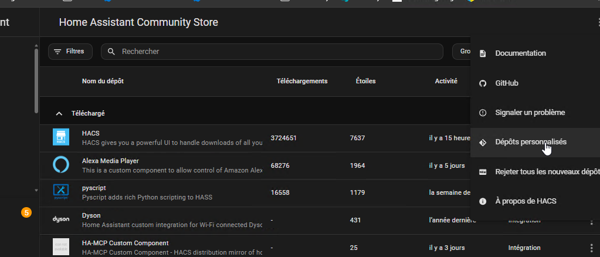

# Contrôle parental Freebox pour Home Assistant

[](https://github.com/hacs/integration)

Pilotez l'**accès à Internet par profil** de votre **Freebox** directement
depuis Home Assistant — la fonction de contrôle parental / réseau que
l'intégration Freebox officielle ne propose pas.

Chaque *profil de contrôle réseau* de la Freebox (en général un par membre de la
famille) est exposé sous forme de :

- un **interrupteur** — `Activé` = ce profil a Internet ; **éteignez-le** pour
  **couper** Internet, **rallumez-le** pour le **rétablir** ;
- un **capteur** — le nombre d'appareils rattachés au profil, avec leur nom et
  leur état en ligne dans les attributs.

Tout fonctionne **en local** sur `http://mafreebox.freebox.fr`. Rien ne passe
par le cloud Freebox, et le jeton d'application est stocké dans l'entrée de
configuration.

## Pourquoi cette intégration

L'intégration Freebox officielle du cœur de HA n'expose que l'interrupteur Wi-Fi
global et la présence des appareils (device_tracker). **Aucune** intégration
existante ne pilote les **profils** de contrôle parental / réseau. Celle-ci
comble ce manque avec un vrai composant personnalisé, configurable via l'UI.

## Installation

L'installation se fait en **trois** étapes : installer le code (HACS), ajouter
l'intégration dans Home Assistant, puis accorder les droits sur la Freebox.
Faites-les dans l'ordre.

### Étape 1 — Installer via HACS (dépôt personnalisé)

1. Dans la **barre latérale** de Home Assistant, ouvrez **HACS** (pas *Réglages*).
2. En haut à droite, cliquez sur le menu **⋮** → **Dépôts personnalisés** :

   

3. Dans la boîte de dialogue, renseignez :
   - **Dépôt** : `https://github.com/kayasax/freebox-parental-control`
   - **Type / Catégorie** : **Intégration**
   puis cliquez sur **Ajouter**.
4. Fermez la fenêtre, cherchez **Freebox Parental Control** dans HACS, ouvrez-la
   et cliquez sur **Télécharger**.
5. **Redémarrez Home Assistant** quand c'est proposé
   (*Réglages → Système → icône d'alimentation en haut à droite → Redémarrer*).

### Étape 2 — Ajouter l'intégration

6. Allez dans **Réglages → Appareils et services → Ajouter une intégration**,
   cherchez **Freebox Parental Control** et sélectionnez-la.
7. Gardez l'adresse par défaut (`http://mafreebox.freebox.fr`) et validez.
8. **Rendez-vous devant votre Freebox** : son écran LCD en façade affiche une
   demande d'autorisation — appuyez sur la **flèche droite** puis **OK** pour
   accorder l'accès. De retour dans Home Assistant, validez la seconde étape.

À ce stade l'intégration est ajoutée, mais les interrupteurs afficheront
`insufficient_rights` tant que vous n'avez pas fait l'étape 3.

### Étape 3 — Accorder les droits dans Freebox OS (obligatoire)

Valider la demande sur l'écran LCD ne fait que *créer* l'application ; par
défaut la Freebox ne lui donne que des droits **minimaux**, **insuffisants**
pour piloter l'accès réseau. Activez les droits une fois :

**1. Ouvrez Freebox OS** (`http://mafreebox.freebox.fr`), puis
**Paramètres de la Freebox -> Gestion des accès** :


**2. Ouvrez l'onglet _Applications_**, trouvez **HA Freebox Parental Control**
et cliquez sur l'icône **crayon (Éditer)** :


**3. Cochez les droits nécessaires** — au minimum
**Modification des réglages de la Freebox** ; activez aussi
**Accès au contrôle parental** et **Gestion des profils utilisateur** — puis
**OK** :


**4. L'application liste désormais les droits accordés :**


**5. De retour dans Home Assistant**, rechargez l'intégration
(**Réglages -> Appareils et services -> Freebox Parental Control -> ⋮ -> Recharger**).
Les interrupteurs et capteurs des profils apparaissent en moins d'une minute.

## Prérequis

- Home Assistant doit être sur le **même réseau local** que la Freebox.
- Une version de Freebox OS exposant `network_control` (Freebox OS v15+).

## Utilisation

### Interrupteurs — couper / rétablir Internet

Chaque profil a un `switch.<profil>_internet` : **allumé = Internet autorisé**,
éteignez-le pour couper, rallumez-le pour rétablir. Utilisable dans des
automatisations, des scripts, des tableaux de bord ou depuis un bouton physique.

### Capteurs d'appareils — qui est dans chaque profil

Chaque profil a un `sensor.<profil>_devices` dont l'état est le nombre
d'appareils. Ses attributs comprennent :

- `online_count` — combien d'appareils du profil sont actuellement en ligne ;
- `device_status` — une liste `{name, online, mac}` pour chaque appareil ;
- `devices` / `macs` — les listes simples de noms et d'adresses MAC.

Un tableau de bord prêt à l'emploi (voir `dashboard_freebox_profils.json` dans
le dépôt) liste les appareils de chaque profil avec un indicateur en ligne.

### Coupure minutée — service `cut_for`

Pour couper un profil pendant une durée bornée avec rétablissement automatique,
appelez le service `freebox_network_control.cut_for` sur un interrupteur de
profil :

```yaml
service: freebox_network_control.cut_for
target:
  entity_id: switch.elyas_internet
data:
  minutes: 45
```

### Programmation — intégrée à l'intégration

Ouvrez **Réglages -> Appareils et services -> Freebox Parental Control ->
Configurer**. Pour chaque profil vous pouvez activer une programmation
automatique : une **heure de coupure**, une **heure de rétablissement** et les
**jours** concernés. L'intégration exécute ces programmations elle-même — aucune
automatisation ni blueprint nécessaire — de sorte que chaque utilisateur trouve
la fonction au même endroit. Internet est coupé à l'heure de coupure les jours
sélectionnés, et toujours rétabli à l'heure de rétablissement.

Un blueprint (`blueprints/automation/kayasax/freebox_scheduled_cut.yaml`) est
aussi disponible si vous préférez exprimer les programmations sous forme
d'automatisations Home Assistant avec des conditions supplémentaires (présence,
vacances, aides…).

## Feuille de route

- **Phase A** — interrupteurs + capteurs d'appareils, config flow. Fait.
- **Phase B** — état en ligne par appareil, coupure minutée (`cut_for`),
  programmation (UI d'options intégrée + blueprint). Fait.
- **Phase C** — service d'assignation d'appareils, gestion des profils
  (création/suppression), et remontée du support async `network_control` /
  `profile` vers [`freebox-api`](https://github.com/hacf-fr/freebox-api).

## Crédits

Construit à partir d'un client Freebox local éprouvé. Non affilié à Free /
Freebox.

## Licence

[MIT](LICENSE)
