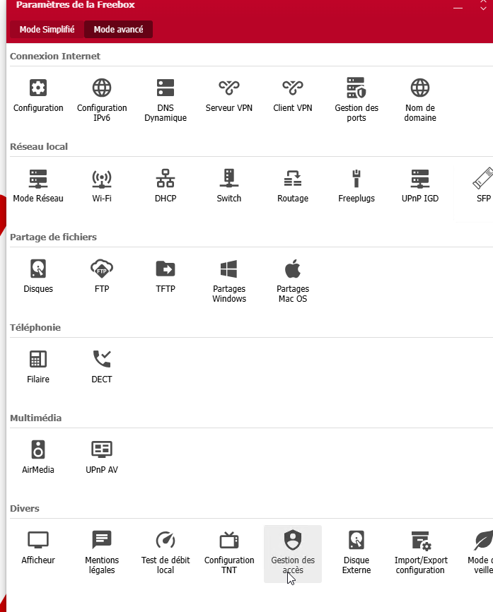
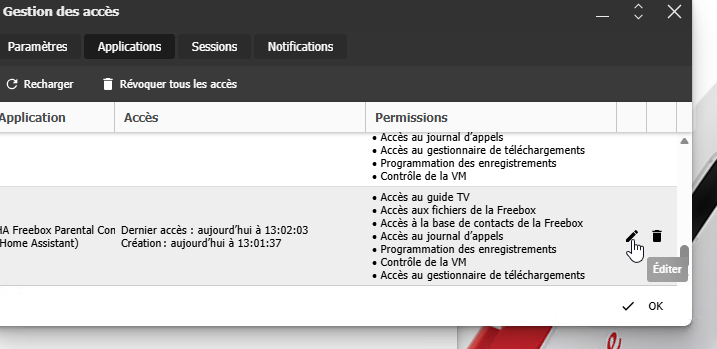
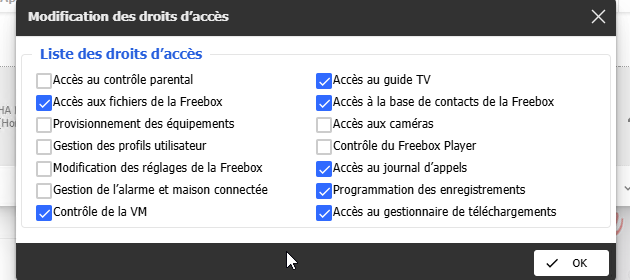
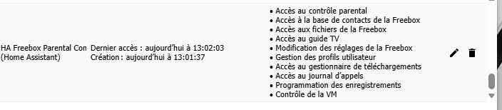

# Freebox Parental Control for Home Assistant

Control **per-profile Internet access** on your **Freebox** directly from Home
Assistant — the parental / network-control feature the official Freebox
integration does not provide.

Each Freebox *network-control profile* (typically one per family member) is
exposed as:

- a **switch** — `ON` = that profile has Internet; turn it **OFF** to cut the
  Internet, **ON** to restore it;
- a **sensor** — the number of devices assigned to the profile, with their
  resolved names as attributes.

Everything runs **locally** against `http://mafreebox.freebox.fr`. Nothing goes
through the Freebox cloud, and the app token is stored in the config entry — no
token in any file.

## Why this exists

The official core Freebox integration only exposes the global Wi-Fi switch and
device-tracker presence. **No** existing integration controls the parental /
network-control **profiles**. This integration fills that gap with a real,
config-flow-driven custom component.

## Installation (HACS)

1. In HACS → **Integrations** → ⋮ menu → **Custom repositories**, add
   `https://github.com/kayasax/freebox-parental-control` with category
   **Integration**.
2. Install **Freebox Parental Control**, then **restart Home Assistant**.
3. Go to **Settings → Devices & Services → Add Integration** and search for
   **Freebox Parental Control**.
4. Keep the default address (`http://mafreebox.freebox.fr`) and submit.
5. **Walk to your Freebox**: its front LCD screen shows an authorization
   request — press the **right arrow**, then **OK** to grant access. Back in
   Home Assistant, submit the second step to finish.
6. **Grant the app the required rights in Freebox OS** (mandatory — see below),
   otherwise the switches will fail with `insufficient_rights`.

## Grant the required rights in Freebox OS (required)

Approving the request on the LCD screen only creates the app; by default the
Freebox grants it **minimal** rights, which are **not** enough to change
network-control. Without this the config entry loads but the switches report
`insufficient_rights`. Enable the rights once:

**1. Open Freebox OS** (`http://mafreebox.freebox.fr`), then
**Paramètres de la Freebox → Gestion des accès**:

**2. Open the _Applications_ tab**, find **HA Freebox Parental Control** and
click the **pencil (Éditer)** icon:

**3. Tick the required rights** — at minimum
**Modification des réglages de la Freebox**; also enable
**Accès au contrôle parental** and **Gestion des profils utilisateur** — then
**OK**:

**4. The app now lists the granted rights:**

**5. Back in Home Assistant**, reload the integration
(**Settings → Devices & Services → Freebox Parental Control → ⋮ → Reload**).
The profile switches and device sensors appear within a minute.

## Requirements

- Home Assistant must be on the **same LAN** as the Freebox.
- A Freebox OS version exposing `network_control` (Freebox OS v15+).

## Usage

Once set up, use the profile switches in automations, scripts, or dashboards —
for example cut a child's Internet on a schedule, or from a button. The device
sensor lets you see (and automate on) which devices belong to each profile.

## Roadmap

- **Phase A (current)** — switches + device sensors, config flow. ✅
- **Phase B** — assign/remove devices to a profile, bounded cut duration,
  schedule editing.
- **Phase C** — upstream async `network_control` / `profile` support to
  [`freebox-api`](https://github.com/hacf-fr/freebox-api).

## Credits

Built from a proven local Freebox client. Not affiliated with Free / Freebox.

## License

[MIT](LICENSE)
